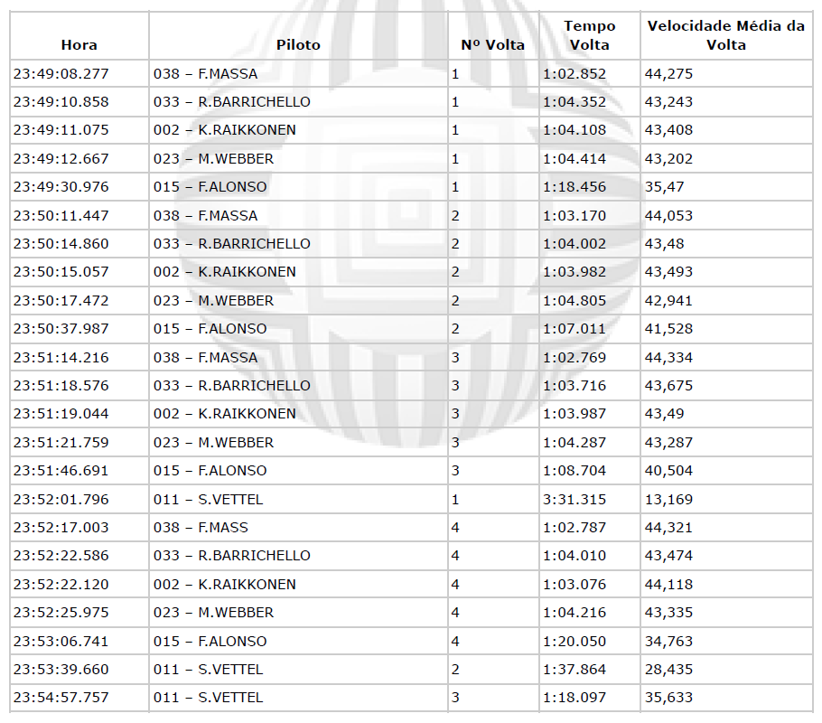

# 📂 Desafio de Lógica - Grupo CRIAR

## 📃 Descrição

Esse projeto consiste em resolver um desafio de lógica baseado em um log de uma corrida de Kart. O objetivo é processar os dados fornecidos do log e apresentar um resultado final em formato tabular.

## Objetivos

- Montar o resultado da corrida com:
  - Posição de Chegada
  - Código do Piloto
  - Nome do Piloto
  - Quantidade de Voltas Completadas
  - Tempo Total de Prova

## Dados

Os dados da corrida são fornecidos em um log que contém informações sobre o horário, piloto, número da volta, tempo da volta e velocidade média da volta. A corrida termina quando o primeiro colocado completa 4 voltas.

### Logs da Corrida

## Bônus (Opcional)

- Descobrir a melhor volta de cada piloto
- Descobrir a melhor volta da corrida
- Calcular a velocidade média de cada piloto durante toda a corrida
- Descobrir quanto tempo cada piloto chegou após o vencedor

## Tecnologias que podem ser Utilizadas

- PHP, C# ou Java (a escolha do desenvolvedor)

---
---

## Resolução do Desafio

Após análise do desafio proposto optei em dividir a solução nas seguintes etapas: 

- Criação do arquivo README.md com informações detalhadas
- Preparação do ambiente de desenvolvimento em Docker
- Criação de um arquivo SQL para gerar o banco e inserir dados obtidos no log
- Criação do arquivo PHP para implementação da lógica
- Criação de uma página web para apresentação dos resultados obtidos

## 🚀 Tecnologias Utilizadas

- HTML
- CSS
- JavaScript
- PHP
- MySQL
- Git e Github
- Docker

### Subir Containers do Projeto

    docker-compose up -d

### Caso necessite de permissões de acesso execute o comando na pasta raíz do projeto

    sudo chmod -R 777 .

### Dê permissão de execução ao script

    chmod +x setup.sh

### Execute o script

    ./setup.sh

### Acessar o
Projeto: [http://localhost/](http://localhost/) 

### Faça importação do banco **race_data.sql** no phpMyAdmin
phpMyAdmin: [http://localhost:8080/](http://localhost:8080/)

---
---

### Encerrar containers em execução

    docker-compose down

### Remover Todos os Contêineres e Imagens em Um Comando

    docker stop $(docker ps -aq) && docker rm $(docker ps -aq) && docker rmi $(docker images -q)

---
---
## 📧 Contato
[LinkedIn](https://www.linkedin.com/in/wsawebmaster/)

[wsawebmaster@yahoo.com.br](mailto:wsawebmaster@yahoo.com.br)